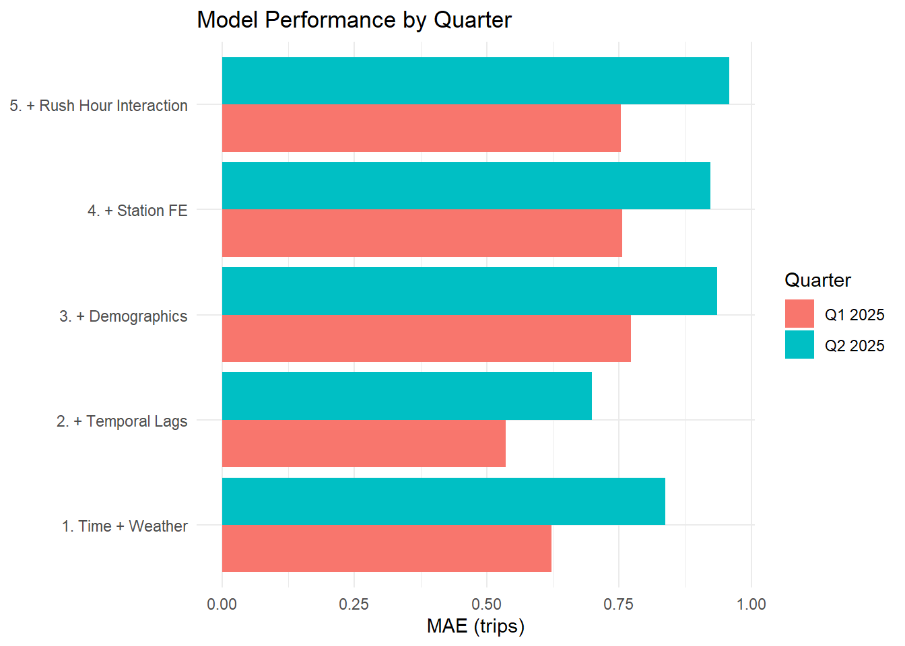
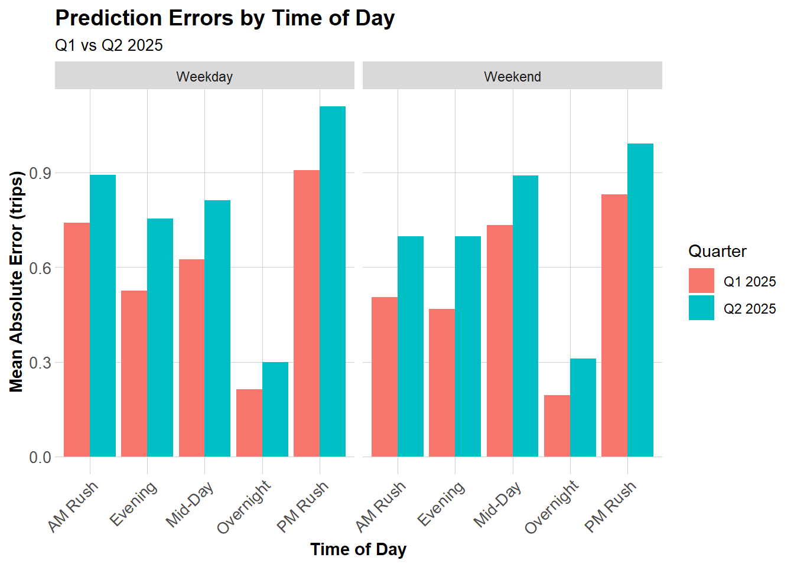

::: {.callout-note appearance="minimal"}
**Course:** MUSA 5080 — Geospatial Machine Learning for Urban Planning, University of Pennsylvania
**Portfolio:** [mohamadalabbas-phd.github.io](https://mohamadalabbas-phd.github.io)
**Summary:** Develops space-time predictive models for Indego bike share demand across Philadelphia stations, using temporal lag features, spatial nearest-neighbor features, and panel cross-validation to maximize operational rebalancing value.
:::

# Report: Rebalancing Indego Bikes in Philadelphia

## Introduction

Indego’s rebalancing problem is really an **availability** problem: riders don’t experience “demand,” they experience whether a station has **a bike when they want to start** and **an open dock when they want to end**. When stations drift into stockouts (no bikes) or dockouts (no empty docks), the system loses trips, frustrates riders, and can even push people back toward less sustainable modes. Because rebalancing trucks, staff, and time are limited—especially in the short window before commute peaks—Indego benefits from forecasting which stations are most likely to become constrained so it can **restock bikes proactively** and keep service reliable across the network.

Getting availability right also matters because rebalancing decisions compound: moving bikes to fix one hotspot can unintentionally create shortages elsewhere. Prediction tools are valuable when they help operations managers prioritize scarce capacity—flagging likely stockout stations with enough lead time to act—while minimizing wasted trips from over-reacting to noise. In that sense, the goal of forecasting isn’t perfect point prediction; it’s maintaining **consistent access** by preventing the most disruptive availability failures before they happen.

In class we had constructed models that captured Q1 of 2025 bike ridership. Now, we replicate the full modeling pipeline in Q2 2025 (April–June) and compare it to Q1 2025 (January–March) because Indego demand is seasonal and model performance can shift when the system moves from winter commuting patterns into spring and early-summer riding. Importantly, this is not a test where a Q1-trained model is applied to Q2. Instead, we retrain the same set of model specifications within each quarter (same variables, same lag structure, same train/test logic), and then evaluate performance on a within-quarter future period. This design lets us answer a different operational question: when Indego updates or refits its forecasting system for a new season, do the same feature choices still deliver accurate predictions, and do the same types of errors show up in the same places and times? By holding the modeling recipe constant while allowing coefficients to re-estimate each quarter, differences in MAE and error patterns can be interpreted as evidence of behavioral seasonality and changing station dynamics, rather than simple model transfer failure.

## Model Comparison & Error Analysis Insights

::: {#fig-q2-errors}
{width=700}
Figure 1: Model Performance By Quartile (Q1 & Q2) in Trips
:::

Across both quarters, Model 2 (Time + Weather + Temporal Lags) consistently delivers the best predictive performance, making it our preferred operational baseline. In Q1 2025, MAE drops from 0.62 in the simple time-and-weather baseline (Model 1) to 0.54 once we add lagged demand (Model 2). That improvement is exactly what we would expect in bike share systems: station-hour demand is highly persistent, so recent past usage is one of the most reliable signals for near-future demand. By contrast, Models 3–5 perform noticeably worse in Q1 (MAE 0.75–0.77), suggesting that adding demographic context, station fixed effects, or the rush-hour interaction does not translate into better out-of-sample prediction in this setup.


The same story holds, and is even clearer, in Q2 2025, though accuracy is lower overall. MAE is 0.84 for Model 1 and improves to 0.70 for Model 2, again showing that temporal persistence is doing the heavy lifting. However, Q2 errors are systematically higher than Q1 for every model (e.g., Model 2 rises from 0.54 → 0.70), which is consistent with Q2 having more volatile demand patterns (spring/summer riding, events, tourism, and generally more “irregular” trip behavior). Importantly, the feature-rich models still do not help here: Models 3–5 range from 0.92 to 0.96, reinforcing that complexity alone doesn’t guarantee better forecasts, especially when the added predictors are either weakly related to hour-to-hour variation or introduce noise/overfitting.

::: {#fig-q2-errors}
::: columns
::: column
{width=100%}
:::

::: column
{width=100%}
:::
:::
Figure 2: Prediction errors (time + space), Q2 2025.
:::

Figure 2(a) shows a clear and consistent time-of-day structure in prediction error for Model 2 across both quarters. Errors are lowest overnight (when demand is near-zero and more stable) and rise sharply during peak travel periods, especially the PM rush hour, which is the highest-error block on both weekdays and weekends. Importantly, errors are systematically higher in Q2 than Q1 across nearly every time block—consistent with the overall MAE comparison (Model 2: 0.70 in Q2 vs. 0.54 in Q1). This does not mean the same trained model “transfers” equally well across seasons; rather, it suggests that even when the model is retrained in each quarter, the same structural weakness remains: it struggles most when demand is most volatile (commute peaks, leisure surges, and rapid within-day shifts).

Spatially Fig 2(b), the largest station-level MAEs cluster in and around Center City and University City, while many peripheral stations show lower errors. This pattern aligns with the idea that stations in the urban core experience high volume and higher variance: more trips, more directional commuting waves, and more sensitivity to factors not included in the model. Note that the map is MAE (absolute error), so it reflects magnitude rather than whether predictions are systematically over- or under-shooting. Still, the core clustering strongly suggests the model is missing predictors that matter most precisely where operations pressure is highest—i.e., the stations where stockouts/dockouts are most likely to occur and where rebalancing decisions are most consequential.

## New Features & Assessments

The error diagnostics suggest that Model 2’s weakest performance occurs precisely when demand is least stable—especially during the PM rush hour and, more broadly, during periods when trip volumes shift quickly within the day. Overnight hours, when travel is sparse and predictable, show the lowest MAE, while peak periods show the highest MAE. This pattern implies that simple short-run persistence (e.g., lag1Hour, lag3Hours, lag1day) captures routine momentum, but may still miss weekly regularities or recurring schedule-driven behavior that reappears on a weekly cycle. For this reason, in Part 11 we extend the lag structure by adding lag1week (same hour one week ago) to help the model learn repeated weekly patterns that are especially relevant for commuting rhythms and consistently scheduled activities.

A second takeaway is that Q2 errors are consistently higher than Q1 across most time buckets, which suggests that spring/early summer demand is not just “more demand,” but more variable demand—likely shaped by calendar-based disruptions (holidays, long weekends, and end-of-semester transitions) that aren’t fully summarized by weather + hour + day-of-week alone. To address this, Part 11 introduces holiday indicators plus day-before/day-after holiday flags, which are designed to capture the predictable spikes and dips that happen around long weekends and public holidays, when commuting drops but recreational riding may rise and timing may shift.

Finally, the spatial concentration of higher errors around Center City and University City suggests that the model struggles most in places where cycling patterns are shaped by institutional schedules and periodic population surges (students, campus commuters), not only by the usual time/weather structure. That directly motivates adding university calendar flags (in-session vs. no-classes periods). These features aim to capture systematic changes in trip generation near major campuses that would otherwise appear to the model as “unexplained noise,” especially in the core neighborhoods where the MAE is highest and where operational rebalancing decisions matter most.


::: {#tbl-part11-mae}
| Quarter | Original Baseline Model 2 | Model 2 (Quad Weather) | Model 2 + Calendar | delta_MAE |
|---|---:|---:|---:|---:|
| Q1 2025 | 0.535 | 0.528 | 0.531 | 0.003
| Q2 2025 | 0.698 | 0.694 | 0.694 | 0.000

Table: MAE Comparison + Delta (Calendar - Baseline)
:::

The Table above shows three versions of Model 2 evaluated within each quarter: the original linear-weather specification, an updated version with quadratic weather terms plus an added weekly lag, and a further-augmented version that adds holiday timing and university calendar indicators. In Q1 2025, moving from the original baseline (MAE = 0.535) to the quadratic-weather + weekly-lag version produces a small improvement (MAE = 0.528), suggesting that modest nonlinearity in weather response and weekly repetition helps capture some demand structure that linear terms and shorter lags miss. However, adding the holiday and university calendar features slightly worsens error (MAE = 0.531), yielding a positive delta (ΔMAE = +0.003; +0.584%). This implies that, in Q1, the introduced calendar signals either (i) do not align strongly with demand variation in this winter/early-spring period, or (ii) add noise/collinearity relative to the dominant temporal pattern already captured by hour, day-of-week, and lag structure.

In Q2 2025, the results are even more decisive: the original baseline MAE is 0.698, and the quadratic-weather + weekly-lag model improves only marginally to 0.694. Adding holidays and the university calendar produces essentially no change (MAE remains 0.694; ΔMAE ≈ +0.000; +0.002%). In other words, once we account for temporal persistence and flexible weather effects, the holiday/calendar variables provide almost no additional predictive power for Q2 in this setup. Practically, this suggests that the largest remaining errors in Q2 are likely driven by factors not encoded by these features—such as special events, station capacity constraints, operational rebalancing actions themselves, or localized micro-weather and land-use patterns—rather than broad academic/holiday schedule shifts.

Part 3 demonstrates that the big gains come from core time dynamics (lags, weekly repetition) and nonlinear weather, while the added calendar indicators have weak incremental value under MAE. This is still a useful outcome: it tells us that improving prediction further likely requires more spatially-specific or operational features (e.g., proximity to venues/parks, station capacity, nearby employment density, or event calendars), rather than additional broad “calendar context” variables.

## Deployment and Operational Considerations

From an operations standpoint, the value of our forecasts is not in perfectly predicting trip counts, but in anticipating when stations are likely to drift toward stockouts (no bikes) or dockouts (no docks) during high-stakes windows. Our results suggest that the “best” model (Model 2 with temporal lags) is reasonably stable across seasons, but errors are largest during rush-hour periods—exactly when rebalancing decisions matter most. That implies a practical deployment rule: the model should be used as a screening tool to prioritize stations for truck routes before commute peaks, rather than as a fully automated decision-maker. In other words, even if the average MAE is modest, the operational risk concentrates in the times and places where a few missed calls can lead to many lost trips.

If Indego were to deploy this system, we would recommend it be part of a larger system that aims to flag or capture potentially vulnerable stations that other robust systems can examine and further provide isnight/recommendations on it. The seasonal comparison also showed that Q2 is harder to predict overall (higher MAEs across models), Indego should treat summer deployment as more uncertain and add safeguards—like conservative thresholds that prioritize avoiding stockouts in the busiest areas even at the expense of occasional unnecessary rebalancing.

------------------------------------------------------------------------

# Technical Appendix

The technical appendix provides the supporting details behind our modeling workflow and results, documenting the full data pipeline and analytical choices used to generate the figures and performance metrics in the main report. It includes the steps for cleaning and aggregating Indego trip data into a station-by-hour panel, merging station-level census context and hourly weather measures, constructing temporal lag features, and implementing the quarter-specific temporal train/test splits. We also report model specifications, evaluation procedures (including MAE computation), and additional diagnostics and feature-engineering extensions (e.g., quadratic weather terms and holiday/university calendar indicators) so that the analysis is transparent, reproducible, and easy to audit or extend.

## Reproducing In-Class Q1 Results

This section reproduces the analytical approach for Q1 analysis conducted in class. 

### 0.0 \|  Setup


```{r setup}
#| message: false
#| warning: false
#| results: 'hide'

library(tidyverse)
library(lubridate)
library(sf)
library(tigris)
library(tidycensus)
library(broom)
library(here)
library(riem)  # For Philadelphia weather from ASOS stations

# Visualization
library(viridis)
library(gridExtra)
library(knitr)
library(kableExtra)
library(gganimate)

options(scipen = 999)

# ── Visual Themes ─────────────────────────────────────────────────────────────
plotTheme <- theme(
  plot.title       = element_text(size = 14, face = "bold"),
  plot.subtitle    = element_text(size = 11, color = "grey40"),
  plot.caption     = element_text(size = 8,  color = "grey55", hjust = 1),
  axis.text        = element_text(size = 9),
  axis.title       = element_text(size = 10, face = "bold"),
  panel.grid.minor = element_blank(),
  panel.background = element_rect(fill = "#fafafa", color = NA),
  plot.background  = element_rect(fill = "white",   color = NA),
  legend.title     = element_text(size = 9,  face = "bold"),
  legend.text      = element_text(size = 8)
)

mapTheme <- theme_void() +
  theme(
    plot.title      = element_text(size = 14, face = "bold"),
    plot.subtitle   = element_text(size = 11, color = "grey40"),
    plot.caption    = element_text(size = 8,  color = "grey55", hjust = 1),
    legend.title    = element_text(size = 9,  face = "bold"),
    legend.text     = element_text(size = 8),
    plot.background = element_rect(fill = "white", color = NA)
  )

palette5 <- c("#f0f9e8", "#bae4bc", "#7bccc4", "#43a2ca", "#0868ac")

```


```{r census key}
#| include: false

census_api_key("fe841b7ef0aa73d9579f0517bd1c8f26d33c789b")
```

### 0.1 \| Load and Process Indego Trip Data

**Importing Data**

```{r load-indego, cache = TRUE}

# Summon indego data from Q1 & Q2

indego <- read_csv("data/indego-trips-2025-q1.csv")
indego_q2 <- read_csv("data/indego-trips-2025-q2.csv")

# Helper function to create time bins – aggregate trips into hourly intervals for panel data structure

indego <- indego %>%
  mutate(
    # Parse datetime
    start_datetime = mdy_hm(start_time),
    end_datetime = mdy_hm(end_time),
    
    # Create hourly bins
    interval60 = floor_date(start_datetime, unit = "hour"),
    
    # Extract time features
    week = week(interval60),
    month = month(interval60, label = TRUE),
    dotw = wday(interval60, label = TRUE),
    hour = hour(interval60),
    date = as.Date(interval60),
    
    # Create useful indicators
    weekend = ifelse(dotw %in% c("Sat", "Sun"), 1, 0),
    rush_hour = ifelse(hour %in% c(7, 8, 9, 16, 17, 18), 1, 0)
  )
```

**Daily Trip Counts**

```{r trips_over_time}
daily_trips <- indego %>%
  group_by(date) %>%
  summarize(trips = n())

ggplot(daily_trips, aes(x = date, y = trips)) +
  geom_line(color = "#3182bd", linewidth = 1) +
  geom_smooth(se = FALSE, color = "red", linetype = "dashed") +
  labs(
    title = "Indego Daily Ridership - Q1 2025",
    subtitle = "Winter demand patterns in Philadelphia",
    x = "Date",
    y = "Daily Trips",
    caption = "Source: Indego bike share"
  ) +
  plotTheme
```

There is certainlly month-specific demands that look both seasonal and event-driven.

**Hourly Patterns**

```{r hourly_patterns}
# Average trips by hour and day type
hourly_patterns <- indego %>%
  group_by(hour, weekend) %>%
  summarize(avg_trips = n() / n_distinct(date)) %>%
  mutate(day_type = ifelse(weekend == 1, "Weekend", "Weekday"))

ggplot(hourly_patterns, aes(x = hour, y = avg_trips, color = day_type)) +
  geom_line(linewidth = 1.2) +
  scale_color_manual(values = c("Weekday" = "#08519c", "Weekend" = "#6baed6")) +
  labs(
    title = "Average Hourly Ridership Patterns - Q1 2025",
    subtitle = "Clear commute patterns on weekdays",
    x = "Hour of Day",
    y = "Average Trips per Hour",
    color = "Day Type"
  ) +
  plotTheme
```

Clear spikes during the weekday at specific AM and PM rush hours. 

**Top Stations**

```{r}
# Most popular origin stations
top_stations <- indego %>%
  count(start_station, start_lat, start_lon, name = "trips") %>%
  arrange(desc(trips)) %>%
  head(20)

kable(top_stations, 
      caption = "Top 20 Indego Stations by Trip Origins - Q1 2025",
      format.args = list(big.mark = ",")) %>%
  kable_styling(bootstrap_options = c("striped", "hover"))
```


There is some clustering on which stations are most used and they appeared to be located in both center city - old city as well as university city. 

### 0.2 \| Load Philadelphia Census Data

```{r load-census, cache = TRUE, progress = FALSE, results = 'hide'}
# Get Philadelphia census tracts
philly_census <- get_acs(
  geography = "tract",
  variables = c(
    "B01003_001",  # Total population
    "B19013_001",  # Median household income
    "B08301_001",  # Total commuters
    "B08301_010",  # Commute by transit
    "B02001_002",  # White alone
    "B25077_001"   # Median home value
  ),
  state = "PA",
  county = "Philadelphia",
  year = 2022,
  geometry = TRUE,
  output = "wide"
) %>%
  rename(
    Total_Pop = B01003_001E,
    Med_Inc = B19013_001E,
    Total_Commuters = B08301_001E,
    Transit_Commuters = B08301_010E,
    White_Pop = B02001_002E,
    Med_Home_Value = B25077_001E
  ) %>%
  mutate(
    Percent_Taking_Transit = (Transit_Commuters / Total_Commuters) * 100,
    Percent_White = (White_Pop / Total_Pop) * 100
  ) %>%
  st_transform(crs = 4326)  # WGS84 for lat/lon matching
```

**Map Philadelphia Context**

```{r map-philly}
# Map median income
ggplot() +
  geom_sf(data = philly_census, aes(fill = Med_Inc), color = NA) +
  scale_fill_viridis(
    option = "viridis",
    name = "Median\nIncome",
    labels = scales::dollar
  ) +
  labs(
    title = "Philadelphia Median Household Income by Census Tract",
    subtitle = "Context for understanding bike share demand patterns"
  ) +
  # Stations 
  geom_point(
    data = indego,
    aes(x = start_lon, y = start_lat),
    color = "red", size = 0.4, alpha = 0.6
  ) +
  mapTheme
```


We note, once again, that the majority of the indego stations are clustered around center city and university city servicing a largely urban and younger population. 

**Join Census Data to Stations**

```{r visualize-fishnet}
# Create sf object for stations
stations_sf <- indego %>%
  distinct(start_station, start_lat, start_lon) %>%
  filter(!is.na(start_lat), !is.na(start_lon)) %>%
  st_as_sf(coords = c("start_lon", "start_lat"), crs = 4326)

# Spatial join to get census tract for each station
stations_census <- st_join(stations_sf, philly_census, left = TRUE) %>%
  st_drop_geometry()
```

**Left-Join Census Data to Q1 Indego Data**

```{r}
# Flag stations in non-residential census tracts
stations_for_map <- indego %>%
  distinct(start_station, start_lat, start_lon) %>%
  filter(!is.na(start_lat), !is.na(start_lon)) %>%
  left_join(
    stations_census %>% select(start_station, Med_Inc),
    by = "start_station"
  ) %>%
  mutate(has_census = !is.na(Med_Inc))

# Add back to trip data
indego_census <- indego %>%
  left_join(
    stations_census %>% 
      select(start_station, Med_Inc, Percent_Taking_Transit, 
             Percent_White, Total_Pop),
    by = "start_station"
  )

# Prepare data for visualization
stations_for_map <- indego %>%
  distinct(start_station, start_lat, start_lon) %>%
  filter(!is.na(start_lat), !is.na(start_lon)) %>%
  left_join(
    stations_census %>% select(start_station, Med_Inc),
    by = "start_station"
  ) %>%
  mutate(has_census = !is.na(Med_Inc))

# Create the map showing problem stations
ggplot() +
  geom_sf(data = philly_census, aes(fill = Med_Inc), color = "white", size = 0.1) +
  scale_fill_viridis(
    option = "viridis",
    name = "Median\nIncome",
    labels = scales::dollar,
    na.value = "grey90"
  ) +
  # Stations with census data (small grey dots)
  geom_point(
    data = stations_for_map %>% filter(has_census),
    aes(x = start_lon, y = start_lat),
    color = "grey30", size = 1, alpha = 0.6
  ) +
  # Stations WITHOUT census data (red X marks the spot)
  geom_point(
    data = stations_for_map %>% filter(!has_census),
    aes(x = start_lon, y = start_lat),
    color = "red", size = 1, shape = 4, stroke = 1.5
  ) +
  labs(
    title = "Philadelphia Median Household Income by Census Tract",
    subtitle = "Indego stations shown (RED = no census data match)",
    caption = "Red X marks indicate stations that didn't join to census tracts"
  ) +
  mapTheme

```

Given the abundance of stations that cannot be tied to residential census datapoints, we opt to drop those stations from our analysis. 

```{r}
# Identify which stations to keep
valid_stations <- stations_census %>%
  filter(!is.na(Med_Inc)) %>%
  pull(start_station)

# Filter trip data to valid stations only
indego_census <- indego %>%
  filter(start_station %in% valid_stations) %>%
  left_join(
    stations_census %>% 
      select(start_station, Med_Inc, Percent_Taking_Transit, 
             Percent_White, Total_Pop),
    by = "start_station"
  )
```

### 0.3 \| Get Weather Data

**Weather Data for Q1 2025**

```{r get-wea}
#| message: false
#| warning: false

# Get weather from Philadelphia International Airport (KPHL)
# This covers Q1 2025: January 1 - March 31
weather_data <- riem_measures(
  station = "PHL",  # Philadelphia International Airport
  date_start = "2025-01-01",
  date_end = "2025-03-31"
)

# Process weather data
weather_processed <- weather_data %>%
  mutate(
    interval60 = floor_date(valid, unit = "hour"),
    Temperature = tmpf,  # Temperature in Fahrenheit
    Precipitation = ifelse(is.na(p01i), 0, p01i),  # Hourly precip in inches
    Wind_Speed = sknt  # Wind speed in knots
  ) %>%
  select(interval60, Temperature, Precipitation, Wind_Speed) %>%
  # updated in-class code to only keep the first row for each hour
  distinct(interval60, .keep_all = TRUE) 

# Check for missing hours and interpolate if needed
weather_complete <- weather_processed %>%
  complete(interval60 = seq(min(interval60), max(interval60), by = "hour")) %>%
  fill(Temperature, Precipitation, Wind_Speed, .direction = "down")

```

**Visualize Weather Patterns**

```{r}
ggplot(weather_complete, aes(x = interval60, y = Temperature)) +
  geom_line(color = "#3182bd", alpha = 0.7) +
  geom_smooth(se = FALSE, color = "red") +
  labs(
    title = "Philadelphia Temperature - Q1 2025",
    subtitle = "Winter to Early Spring Transition",
    x = "Date",
    y = "Temperature (°F)"
  ) +
  plotTheme
```

Clear relationship showcasing increase in demand dependent on weather patterns. 


### 0.4 \| Aggregate Trips to Station-Hour Level

**Q1 2025**

```{r}
# Count trips by station-hour
trips_panel <- indego_census %>%
  group_by(interval60, start_station, start_lat, start_lon,
           Med_Inc, Percent_Taking_Transit, Percent_White, Total_Pop) %>%
  summarize(Trip_Count = n()) %>%
  ungroup()

```

**Create Complete Panel Structure**

Not every station has trips every hour. We need a **complete panel** where every station-hour combination exists (even if Trip_Count = 0).

```{r}
# Calculate expected panel size
n_stations <- length(unique(trips_panel$start_station))
n_hours <- length(unique(trips_panel$interval60))
expected_rows <- n_stations * n_hours

# Create complete panel
study_panel <- expand.grid(
  interval60 = unique(trips_panel$interval60),
  start_station = unique(trips_panel$start_station)
) %>%
  # Join trip counts
  left_join(trips_panel, by = c("interval60", "start_station")) %>%
  # Replace NA trip counts with 0
  mutate(Trip_Count = replace_na(Trip_Count, 0))

# Fill in station attributes (they're the same for all hours)
station_attributes <- trips_panel %>%
  group_by(start_station) %>%
  summarize(
    start_lat = first(start_lat),
    start_lon = first(start_lon),
    Med_Inc = first(Med_Inc),
    Percent_Taking_Transit = first(Percent_Taking_Transit),
    Percent_White = first(Percent_White),
    Total_Pop = first(Total_Pop)
  )

study_panel <- study_panel %>%
  left_join(station_attributes, by = "start_station")

```

We find 410,032 missing datapoints, or rather hour-station datapoints. After completing the panel we achieve a pnael row of 526,750. 

**Add Time Features**

```{r}
study_panel <- study_panel %>%
  mutate(
    week = week(interval60),
    month = month(interval60, label = TRUE),
    dotw = wday(interval60, label = TRUE),
    hour = hour(interval60),
    date = as.Date(interval60),
    weekend = ifelse(dotw %in% c("Sat", "Sun"), 1, 0),
    rush_hour = ifelse(hour %in% c(7, 8, 9, 16, 17, 18), 1, 0)
  )
```

**Join Weather Data**

```{r}
study_panel <- study_panel %>%
  left_join(weather_complete, by = "interval60")
```

### 0.5 \| Create Temporal Lags

```{r}
# Sort by station and time
study_panel <- study_panel %>%
  arrange(start_station, interval60)

# Create lag variables WITHIN each station
study_panel <- study_panel %>%
  group_by(start_station) %>%
  mutate(
    lag1Hour = lag(Trip_Count, 1),
    lag2Hours = lag(Trip_Count, 2),
    lag3Hours = lag(Trip_Count, 3),
    lag12Hours = lag(Trip_Count, 12),
    lag1day = lag(Trip_Count, 24)
  ) %>%
  ungroup()

# Remove rows with NA lags (first 24 hours for each station)
study_panel_complete <- study_panel %>%
  filter(!is.na(lag1day))

```

**Visualize Lag Correlations**

```{r}
# Sample one station to visualize
example_station <- study_panel_complete %>%
  filter(start_station == first(start_station)) %>%
  head(168)  # One week

# Plot actual vs lagged demand
ggplot(example_station, aes(x = interval60)) +
  geom_line(aes(y = Trip_Count, color = "Current"), linewidth = 1) +
  geom_line(aes(y = lag1Hour, color = "1 Hour Ago"), linewidth = 1, alpha = 0.7) +
  geom_line(aes(y = lag1day, color = "24 Hours Ago"), linewidth = 1, alpha = 0.7) +
  scale_color_manual(values = c(
    "Current" = "#08519c",
    "1 Hour Ago" = "#3182bd",
    "24 Hours Ago" = "#6baed6"
  )) +
  labs(
    title = "Temporal Lag Patterns at One Station",
    subtitle = "Past demand predicts future demand",
    x = "Date-Time",
    y = "Trip Count",
    color = "Time Period"
  ) +
  plotTheme
```

One might argue that 24 hour ago appears to have the most relationship across pattenrs of demand at individual stations. 

### 0.6 \|  Temporal Train/Test Split

Approach: Train on Past Data and Test on Future Data

```{r temporal-split}
# Train on weeks 1-9 (Jan 1 - early March)
# Test on weeks 10-13 (rest of March)

# Which stations have trips in BOTH early and late periods?
early_stations <- study_panel_complete %>%
  filter(week < 10) %>%
  filter(Trip_Count > 0) %>%
  distinct(start_station) %>%
  pull(start_station)

late_stations <- study_panel_complete %>%
  filter(week >= 10) %>%
  filter(Trip_Count > 0) %>%
  distinct(start_station) %>%
  pull(start_station)

# Keep only stations that appear in BOTH periods
common_stations <- intersect(early_stations, late_stations)


# Filter panel to only common stations
study_panel_complete <- study_panel_complete %>%
  filter(start_station %in% common_stations)

# NOW create train/test split
train <- study_panel_complete %>%
  filter(week < 10)

test <- study_panel_complete %>%
  filter(week >= 10)

```

**Model 1: Baseline (Time + Weather)**

```{r model-1}
# Create day of week factor with treatment (dummy) coding
train <- train %>%
  mutate(dotw_simple = factor(dotw, levels = c("Mon", "Tue", "Wed", "Thu", "Fri", "Sat", "Sun")))

# Set contrasts to treatment coding (dummy variables)
contrasts(train$dotw_simple) <- contr.treatment(7)

model1 <- lm(
  Trip_Count ~ as.factor(hour) + dotw_simple + Temperature + Precipitation,
  data = train
)

```

**Model 2: Add Temporal Lags**

```{r model-2}
model2 <- lm(
  Trip_Count ~ as.factor(hour) + dotw_simple + Temperature + Precipitation + 
    lag1Hour + lag3Hours + lag1day, # temporal lags
  data = train
)

```

**Model 3: Add Demographics**

```{r model-3}
model3 <- lm(
  Trip_Count ~ as.factor(hour) + dotw_simple + Temperature + Precipitation +
    lag1Hour + lag3Hours + lag1day +
    Med_Inc.x + Percent_Taking_Transit.y + Percent_White.y, # demographics
  data = train
)

```

**Model 4: Add Station Fixed Effects**

```{r model-4}
model4 <- lm(
  Trip_Count ~ as.factor(hour) + dotw_simple + Temperature + Precipitation +
    lag1Hour + lag3Hours + lag1day +
    Med_Inc.x + Percent_Taking_Transit.y + Percent_White.y +
    as.factor(start_station), # station fixed effects
  data = train
)

```

**Model 5: Add Rush Hour Interaction**

```{r model-5}
model5 <- lm(
  Trip_Count ~ as.factor(hour) + dotw_simple + Temperature + Precipitation +
    lag1Hour + lag3Hours + lag1day + rush_hour + as.factor(month) +
    Med_Inc.x + Percent_Taking_Transit.y + Percent_White.y +
    as.factor(start_station) +
    rush_hour * weekend,  # Rush hour effects different on weekends
  data = train
)

```

**R-squared Fit For Each Model**

```{r}

rsq_tbl <- tibble::tibble(
  Model = c(
    "1. Time + Weather",
    "2. + Temporal Lags",
    "3. + Demographics",
    "4. + Station FE",
    "5. + Rush Hour Interaction"
  ),
  R2 = c(
    summary(model1)$r.squared,
    summary(model2)$r.squared,
    summary(model3)$r.squared,
    summary(model4)$r.squared,
    summary(model5)$r.squared
  ),
  Adj_R2 = c(
    summary(model1)$adj.r.squared,
    summary(model2)$adj.r.squared,
    summary(model3)$adj.r.squared,
    summary(model4)$adj.r.squared,
    summary(model5)$adj.r.squared
  )
) %>%
  mutate(
    R2 = round(R2, 3),
    Adj_R2 = round(Adj_R2, 3)
  )

kable(
  rsq_tbl,
  caption = "Model Fit (Training Set): R-squared and Adjusted R-squared",
  col.names = c("Model", "R\u00B2", "Adj. R\u00B2")
) %>%
  kable_styling(bootstrap_options = c("striped", "hover", "condensed"), full_width = FALSE)

```

### 0.7 \| Predictions on Test Set and MAE

```{r}
# Create day of week factor with treatment (dummy) coding
test <- test %>%
  mutate(dotw_simple = factor(dotw, levels = c("Mon", "Tue", "Wed", "Thu", "Fri", "Sat", "Sun")))

# Set contrasts to treatment coding (dummy variables)
contrasts(test$dotw_simple) <- contr.treatment(7)

test <- test %>%
  mutate(
    pred1 = predict(model1, newdata = test),
    pred2 = predict(model2, newdata = test),
    pred3 = predict(model3, newdata = test),
    pred4 = predict(model4, newdata = test),
    pred5 = predict(model5, newdata = test)
  )

# Calculate MAE for each model
mae_results <- data.frame(
  Model = c(
    "1. Time + Weather",
    "2. + Temporal Lags",
    "3. + Demographics",
    "4. + Station FE",
    "5. + Rush Hour Interaction"
  ),
  MAE = c(
    mean(abs(test$Trip_Count - test$pred1), na.rm = TRUE),
    mean(abs(test$Trip_Count - test$pred2), na.rm = TRUE),
    mean(abs(test$Trip_Count - test$pred3), na.rm = TRUE),
    mean(abs(test$Trip_Count - test$pred4), na.rm = TRUE),
    mean(abs(test$Trip_Count - test$pred5), na.rm = TRUE)
  )
)

kable(mae_results, 
      digits = 2,
      caption = "Mean Absolute Error by Model (Test Set)",
      col.names = c("Model", "MAE (trips)")) %>%
  kable_styling(bootstrap_options = c("striped", "hover"))
```

**Visualize Model Comparison**

```{r}
ggplot(mae_results, aes(x = reorder(Model, -MAE), y = MAE)) +
  geom_col(fill = "#3182bd", alpha = 0.8) +
  geom_text(aes(label = round(MAE, 2)), vjust = -0.5) +
  labs(
    title = "Model Performance Comparison",
    subtitle = "Lower MAE = Better Predictions",
    x = "Model",
    y = "Mean Absolute Error (trips)"
  ) +
  plotTheme +
  theme(axis.text.x = element_text(angle = 45, hjust = 1))
```

### 0.8 \| Observed vs Predicted

```{r obs-vs-pred}
test <- test %>%
  mutate(
    error = Trip_Count - pred2,
    abs_error = abs(error),
    time_of_day = case_when(
      hour < 7 ~ "Overnight",
      hour >= 7 & hour < 10 ~ "AM Rush",
      hour >= 10 & hour < 15 ~ "Mid-Day",
      hour >= 15 & hour <= 18 ~ "PM Rush",
      hour > 18 ~ "Evening"
    )
  )

# Scatter plot by time and day type
ggplot(test, aes(x = Trip_Count, y = pred2)) +
  geom_point(alpha = 0.2, color = "#3182bd") +
  geom_abline(slope = 1, intercept = 0, color = "red", linewidth = 1) +
  geom_smooth(method = "lm", se = FALSE, color = "darkgreen") +
  facet_grid(weekend ~ time_of_day) +
  labs(
    title = "Observed vs. Predicted Bike Trips",
    subtitle = "Model 2 performance by time period",
    x = "Observed Trips",
    y = "Predicted Trips",
    caption = "Red line = perfect predictions; Green line = actual model fit"
  ) +
  plotTheme
```

**Spatial Error Patterns**

```{r spatial-errors}
# Calculate MAE by Station
station_errors <- test %>%
  filter(!is.na(pred2)) %>%
  group_by(start_station, start_lat.x, start_lon.y) %>%
  summarize(
    MAE = mean(abs(Trip_Count - pred2), na.rm = TRUE),
    avg_demand = mean(Trip_Count, na.rm = TRUE),
    .groups = "drop"
  ) %>%
  filter(!is.na(start_lat.x), !is.na(start_lon.y))

base_map <- ggplot() +
  geom_sf(data = philly_census,
          fill = "grey95", color = "white", linewidth = 0.2) +
  mapTheme

# Map 1: Prediction Errors (MAE)
p_err <- base_map +
  geom_point(
    data = station_errors,
    aes(x = start_lon.y, y = start_lat.x, color = MAE),
    size = 0.6,
    alpha = 0.85
  ) +
  scale_color_viridis_c(
    option   = "plasma",
    direction = -1,
    name     = "MAE (trips)"
  ) +
  labs(
    title    = "Prediction Errors",
    subtitle = "MAE per station"
  ) +
  theme(
    legend.title = element_text(size = 10),
    legend.text  = element_text(size = 8)
  )

# Map 2: Average Trip Demand
p_demand <- base_map +
  geom_point(
    data = station_errors,
    aes(x = start_lon.y, y = start_lat.x, color = avg_demand),
    size = 0.6,
    alpha = 0.85
  ) +
  scale_color_viridis_c(
    option   = "viridis",
    direction = 1,
    name     = "Avg demand\n(trips/hr)"
  ) +
  labs(
    title    = "Average Demand",
    subtitle = "Trips per station-hour"
  ) +
  theme(
    legend.title = element_text(size = 10),
    legend.text  = element_text(size = 8)
  )

grid.arrange(p_err, p_demand, ncol = 2)

```

**Temporal Error Patterns**

```{r temporal-errors}
# MAE by time of day and day type
temporal_errors <- test %>%
  group_by(time_of_day, weekend) %>%
  summarize(
    MAE = mean(abs_error, na.rm = TRUE),
    .groups = "drop"
  ) %>%
  mutate(day_type = ifelse(weekend == 1, "Weekend", "Weekday"))

ggplot(temporal_errors, aes(x = time_of_day, y = MAE, fill = day_type)) +
  geom_col(position = "dodge") +
  scale_fill_manual(values = c("Weekday" = "#08519c", "Weekend" = "#6baed6")) +
  labs(
    title = "Prediction Errors by Time Period",
    subtitle = "When is the model struggling most?",
    x = "Time of Day",
    y = "Mean Absolute Error (trips)",
    fill = "Day Type"
  ) +
  plotTheme +
  theme(axis.text.x = element_text(angle = 45, hjust = 1))
```

**Demographic Patterns**

```{r demographic-errors}
# Join demographic data to station errors
station_errors_demo <- station_errors %>%
  left_join(
    station_attributes %>% select(start_station, Med_Inc, Percent_Taking_Transit, Percent_White),
    by = "start_station"
  ) %>%
  filter(!is.na(Med_Inc))

# Create plots
p1 <- ggplot(station_errors_demo, aes(x = Med_Inc, y = MAE)) +
  geom_point(alpha = 0.5, color = "#3182bd") +
  geom_smooth(method = "lm", se = FALSE, color = "red") +
  scale_x_continuous(labels = scales::dollar) +
  labs(title = "Errors vs. Median Income", x = "Median Income", y = "MAE") +
  plotTheme

p2 <- ggplot(station_errors_demo, aes(x = Percent_Taking_Transit, y = MAE)) +
  geom_point(alpha = 0.5, color = "#3182bd") +
  geom_smooth(method = "lm", se = FALSE, color = "red") +
  labs(title = "Errors vs. Transit Usage", x = "% Taking Transit", y = "MAE") +
  plotTheme

p3 <- ggplot(station_errors_demo, aes(x = Percent_White, y = MAE)) +
  geom_point(alpha = 0.5, color = "#3182bd") +
  geom_smooth(method = "lm", se = FALSE, color = "red") +
  labs(title = "Errors vs. Race", x = "% White", y = "MAE") +
  plotTheme

grid.arrange(p1, p2, p3, ncol = 2)
```

------------------------------------------------------------------------

## Assessing Q2 2025 Indego Bikeshare Patterns

### 1.0 \| Data Cleaning/Wrangling for Q2 2025

**Create Time Bins**

```{r}
indego_q2 <- indego_q2 %>%
  mutate(
    start_datetime = mdy_hm(start_time),
    end_datetime = mdy_hm(end_time),
    
    # Create hourly bins and extract time features
    interval60 = floor_date(start_datetime, unit = "hour"),
    week = week(interval60),
    month = month(interval60, label = TRUE),
    dotw = wday(interval60, label = TRUE),
    hour = hour(interval60),
    date = as.Date(interval60),
    
    # Create useful indicators
    weekend = ifelse(dotw %in% c("Sat", "Sun"), 1, 0),
    rush_hour = ifelse(hour %in% c(7, 8, 9, 16, 17, 18), 1, 0)
  )
```

**Daily Trip Counts**

```{r}
daily_trips <- indego_q2 %>%
  group_by(date) %>%
  summarize(trips = n())

ggplot(daily_trips, aes(x = date, y = trips)) +
  geom_line(color = "#3182bd", linewidth = 1) +
  geom_smooth(se = FALSE, color = "red", linetype = "dashed") +
  labs(
    title = "Indego Daily Ridership - Q2 2025",
    subtitle = "Spring demand patterns in Philadelphia",
    x = "Date",
    y = "Daily Trips",
    caption = "Source: Indego bike share"
  ) +
  plotTheme
```

A differing pattern from Q1, rather there is no sudden spikes, rather the pattern fluctuates within arguably similar margins throughout the quartile. 

**Filter out Non-Residential Bike Share Stations**

```{r}
# Filter trip data to valid stations only
indego_q2_census <- indego_q2 %>%
  filter(start_station %in% valid_stations) %>%
  left_join(
    stations_census %>% 
      select(start_station, Med_Inc, Percent_Taking_Transit, 
             Percent_White, Total_Pop),
    by = "start_station"
  )
```

### 1.1 \| Space-Time Panel

**Aggregate Trips to Station-Hour Level**

```{r}
trips_q2_panel <- indego_q2_census %>%
  group_by(interval60, start_station, start_lat, start_lon,
           Med_Inc, Percent_Taking_Transit, Percent_White, Total_Pop) %>%
  summarize(Trip_Count = n()) %>%
  ungroup()
```

**Create Complete Panel**

```{r}
study_q2_panel <- expand.grid(
  interval60 = unique(trips_q2_panel$interval60),
  start_station = unique(trips_q2_panel$start_station)
) %>%
  # Join trip counts
  left_join(trips_q2_panel, by = c("interval60", "start_station")) %>%
  # Replace NA trip counts with 0
  mutate(Trip_Count = replace_na(Trip_Count, 0))

# Fill in station attributes (they're the same for all hours)
station_q2_attributes <- trips_q2_panel %>%
  group_by(start_station) %>%
  summarize(
    start_lat = first(start_lat),
    start_lon = first(start_lon),
    Med_Inc = first(Med_Inc),
    Percent_Taking_Transit = first(Percent_Taking_Transit),
    Percent_White = first(Percent_White),
    Total_Pop = first(Total_Pop)
  )

study_q2_panel <- study_q2_panel %>%
  left_join(station_q2_attributes, by = "start_station")
```

**Add Time Features**

```{r}
study_q2_panel <- study_q2_panel %>%
  mutate(
    week = week(interval60),
    month = month(interval60, label = TRUE),
    dotw = wday(interval60, label = TRUE),
    hour = hour(interval60),
    date = as.Date(interval60),
    weekend = ifelse(dotw %in% c("Sat", "Sun"), 1, 0),
    rush_hour = ifelse(hour %in% c(7, 8, 9, 16, 17, 18), 1, 0)
  )
```

**Join Weather Data**

```{r}

weather_q2 <- riem_measures(
  station = "PHL",  # Philadelphia International Airport
  date_start = "2025-04-01",
  date_end = "2025-06-30"
)

# Process weather data
weather_q2 <- weather_q2 %>%
  mutate(
    interval60 = floor_date(valid, unit = "hour"),
    Temperature = tmpf,  # Temperature in Fahrenheit
    Precipitation = ifelse(is.na(p01i), 0, p01i),  # Hourly precip in inches
    Wind_Speed = sknt  # Wind speed in knots
  ) %>%
  select(interval60, Temperature, Precipitation, Wind_Speed) %>%
  # updated in-class code to only keep the first row for each hour
  distinct(interval60, .keep_all = TRUE) 

# Check for missing hours and interpolate if needed
weather_q2_complete <- weather_q2 %>%
  complete(interval60 = seq(min(interval60), max(interval60), by = "hour")) %>%
  fill(Temperature, Precipitation, Wind_Speed, .direction = "down")

study_q2_panel <- study_q2_panel %>%
  left_join(weather_q2, by = "interval60")
#summary(study_q2_panel %>% select(Trip_Count, Temperature, Precipitation))

ggplot(weather_q2_complete, aes(x = interval60, y = Temperature)) +
  geom_line(color = "#3182bd", alpha = 0.7) +
  geom_smooth(se = FALSE, color = "red") +
  labs(
    title = "Philadelphia Temperature - Q2 2025",
    subtitle = "Spring to Summer Transition",
    x = "Date",
    y = "Temperature (°F)"
  ) +
  plotTheme

```

### 1.2 \| Create Temporal Lag Variables

```{r}
study_q2 <- study_q2_panel %>%
  arrange(start_station, interval60)

# Create lag variables WITHIN each station
study_q2 <- study_q2 %>%
  group_by(start_station) %>%
  mutate(
    lag1Hour = lag(Trip_Count, 1),
    lag2Hours = lag(Trip_Count, 2),
    lag3Hours = lag(Trip_Count, 3),
    lag12Hours = lag(Trip_Count, 12),
    lag1day = lag(Trip_Count, 24)
  ) %>%
  ungroup()

# Remove rows with NA lags (first 24 hours for each station)
study_q2_complete <- study_q2 %>%
  filter(!is.na(lag1day))
```

### 1.3 \| Build 5 Predictive Models

**Temporal Train/Test Split**

```{r}
# Train on Weeks 14-22
# Test on Weeks 23-26
early_q2_stations <- study_q2_complete %>%
  filter(week < 23) %>%
  filter(Trip_Count > 0) %>%
  distinct(start_station) %>%
  pull(start_station)

late_q2_stations <- study_q2_complete %>%
  filter(week >= 23) %>%
  filter(Trip_Count > 0) %>%
  distinct(start_station) %>%
  pull(start_station)

common_q2_stations <- intersect(early_q2_stations, 
                                late_q2_stations)

# Filter panel to only common stations
study_q2_complete <- study_q2_complete %>%
  filter(start_station %in% common_q2_stations)

# create train/test split
train_q2 <- study_q2_complete %>%
  filter(week < 23)

test_q2 <- study_q2_complete %>%
  filter(week >= 23)

```

**Model 1: Baseline (Time + Weather)**

```{r}
train_q2 <- train_q2 %>%
  mutate(dotw_simple = factor(dotw, levels = c("Mon", "Tue", "Wed", "Thu", "Fri", "Sat", "Sun")))

contrasts(train_q2$dotw_simple) <- contr.treatment(7)

model1_q2 <- lm(
  Trip_Count ~ as.factor(hour) + dotw_simple + Temperature + Precipitation,
  data = train_q2
)
```

**Model 2: Add Temporal Lags**

```{r}
model2_q2 <- lm(
  Trip_Count ~ as.factor(hour) + dotw_simple + Temperature + Precipitation + 
    lag1Hour + lag3Hours + lag1day,
  data = train_q2
)
```

**Model 3: Add Demographics**

```{r}
model3_q2 <- lm(
  Trip_Count ~ as.factor(hour) + dotw_simple + Temperature + Precipitation +
    lag1Hour + lag3Hours + lag1day +
    Med_Inc.x + Percent_Taking_Transit.y + Percent_White.y,
  data = train_q2
)
```

**Model 4: Add Station Fixed Effects**

```{r}
model4_q2 <- lm(
  Trip_Count ~ as.factor(hour) + dotw_simple + Temperature + Precipitation +
    lag1Hour + lag3Hours + lag1day +
    Med_Inc.x + Percent_Taking_Transit.y + Percent_White.y +
    as.factor(start_station),
  data = train_q2
)
```

**Model 5: Add Rush Hour Interaction**

```{r}
model5_q2 <- lm(
  Trip_Count ~ as.factor(hour) + dotw_simple + Temperature + Precipitation +
    lag1Hour + lag3Hours + lag1day + rush_hour + as.factor(month) +
    Med_Inc.x + Percent_Taking_Transit.y + Percent_White.y +
    as.factor(start_station) +
    rush_hour * weekend,  # Rush hour effects different on weekends
  data = train_q2
)
```

**R-squared Fit For Each Model**

```{r}

rsq_tbl2 <- tibble::tibble(
  Model = c(
    "1. Time + Weather",
    "2. + Temporal Lags",
    "3. + Demographics",
    "4. + Station FE",
    "5. + Rush Hour Interaction"
  ),
  R2 = c(
    summary(model1_q2)$r.squared,
    summary(model2_q2)$r.squared,
    summary(model3_q2)$r.squared,
    summary(model4_q2)$r.squared,
    summary(model5_q2)$r.squared
  ),
  Adj_R2 = c(
    summary(model1_q2)$adj.r.squared,
    summary(model2_q2)$adj.r.squared,
    summary(model3_q2)$adj.r.squared,
    summary(model4_q2)$adj.r.squared,
    summary(model5_q2)$adj.r.squared
  )
) %>%
  mutate(
    R2 = round(R2, 3),
    Adj_R2 = round(Adj_R2, 3)
  )

kable(
  rsq_tbl,
  caption = "Model Fit (Training Set): R-squared and Adjusted R-squared",
  col.names = c("Model", "R\u00B2", "Adj. R\u00B2")
) %>%
  kable_styling(bootstrap_options = c("striped", "hover", "condensed"), full_width = FALSE)

```

### 1.4 \| Model Evaluation

**Prediction on Test Set and MAE**

```{r}

# Create day of week factor with treatment (dummy) coding
test_q2 <- test_q2 %>%
  mutate(dotw_simple = factor(dotw, levels = c("Mon", "Tue", "Wed", "Thu", "Fri", "Sat", "Sun")))

test_q2 <- test_q2 %>%
  mutate(
    pred1 = predict(model1_q2, newdata = test_q2),
    pred2 = predict(model2_q2, newdata = test_q2),
    pred3 = predict(model3_q2, newdata = test_q2),
    pred4 = predict(model4_q2, newdata = test_q2),
    pred5 = predict(model5_q2, newdata = test_q2)
  )

# Calculate MAE for each model
mae_results_q2 <- data.frame(
  Model = c(
    "1. Time + Weather",
    "2. + Temporal Lags",
    "3. + Demographics",
    "4. + Station FE",
    "5. + Rush Hour Interaction"
  ),
  MAE = c(
    mean(abs(test_q2$Trip_Count - test_q2$pred1), na.rm = TRUE),
    mean(abs(test_q2$Trip_Count - test_q2$pred2), na.rm = TRUE),
    mean(abs(test_q2$Trip_Count - test_q2$pred3), na.rm = TRUE),
    mean(abs(test_q2$Trip_Count - test_q2$pred4), na.rm = TRUE),
    mean(abs(test_q2$Trip_Count - test_q2$pred5), na.rm = TRUE)
  )
)

kable(mae_results_q2, 
      digits = 2,
      caption = "Mean Absolute Error by Model (Test Set) - Q2 2025",
      col.names = c("Model", "MAE (trips)")) %>%
  kable_styling(bootstrap_options = c("striped", "hover"))

```

**Visualize Model Comparison**

```{r}

ggplot(mae_results_q2, aes(x = reorder(Model, -MAE), y = MAE)) +
  geom_col(fill = "#3182bd", alpha = 0.8) +
  geom_text(aes(label = round(MAE, 2)), vjust = -0.5) +
  labs(
    title = "Model Performance Comparison - Q2 2025",
    subtitle = "Lower MAE = Better Predictions",
    x = "Model",
    y = "Mean Absolute Error (trips)"
  ) +
  plotTheme +
  theme(axis.text.x = element_text(angle = 45, hjust = 1))

```

### 1.5 \| Space-Time Error Analysis

```{r}
test_q2 <- test_q2 %>%
  mutate(
    error = Trip_Count - pred2,
    abs_error = abs(error),
    time_of_day = case_when(
      hour < 7 ~ "Overnight",
      hour >= 7 & hour < 10 ~ "AM Rush",
      hour >= 10 & hour < 15 ~ "Mid-Day",
      hour >= 15 & hour <= 18 ~ "PM Rush",
      hour > 18 ~ "Evening"
    )
  )

# Scatter plot by time and day type
ggplot(test_q2, aes(x = Trip_Count, y = pred2)) +
  geom_point(alpha = 0.2, color = "#3182bd") +
  geom_abline(slope = 1, intercept = 0, color = "red", linewidth = 1) +
  geom_smooth(method = "lm", se = FALSE, color = "darkgreen") +
  facet_grid(weekend ~ time_of_day) +
  labs(
    title = "Observed vs. Predicted Bike Trips - Q2 2025",
    subtitle = "Model 2 performance by time period",
    x = "Observed Trips",
    y = "Predicted Trips",
    caption = "Red line = perfect predictions; Green line = actual model fit"
  ) +
  plotTheme
```

**Spatial Patterns**

```{r}
# Calculate MAE by Station
station_errors_q2 <- test_q2 %>%
  filter(!is.na(pred2)) %>%
  group_by(start_station, start_lat.x, start_lon.y) %>%
  summarize(
    MAE = mean(abs(Trip_Count - pred2), na.rm = TRUE),
    avg_demand = mean(Trip_Count, na.rm = TRUE),
    .groups = "drop"
  ) %>%
  filter(!is.na(start_lat.x), !is.na(start_lon.y))

# Base Map
base_map <- ggplot() +
  geom_sf(data = philly_census,
          fill = "grey95", color = "white", linewidth = 0.2) +
  mapTheme

# Map 1: Prediction Errors (MAE)
p_err_q2 <- base_map +
  geom_point(
    data = station_errors_q2,
    aes(x = start_lon.y, y = start_lat.x, color = MAE),
    size = 0.6, alpha = 0.85
  ) +
  scale_color_viridis_c(option = "plasma", direction = -1, name = "MAE (trips)") +
  labs(
    title    = "Prediction Errors",
    subtitle = "MAE per station"
  ) +
  theme(
    legend.title = element_text(size = 10),
    legend.text  = element_text(size = 8)
  )

# Map 2: Average Trip Demand
p_demand_q2 <- base_map +
  geom_point(
    data = station_errors_q2,
    aes(x = start_lon.y, y = start_lat.x, color = avg_demand),
    size = 0.6, alpha = 0.85
  ) +
  scale_color_viridis_c(option = "viridis",
    direction = 1, name = "Avg demand\n(trips/hr)"
  ) +
  labs(
    title    = "Average Demand",
    subtitle = "Trips per station-hour"
  ) +
  theme(
    legend.title = element_text(size = 10),
    legend.text  = element_text(size = 8)
  )

grid.arrange(p_err_q2, p_demand_q2, ncol = 2)

```

**Temporal Patterns**

```{r}

# MAE by time of y and day type
temporal_errors_q2 <- test_q2 %>%
  group_by(time_of_day, weekend) %>%
  summarize(
    MAE = mean(abs_error, na.rm = TRUE),
    .groups = "drop"
  ) %>%
  mutate(day_type = ifelse(weekend == 1, "Weekend", "Weekday"))

ggplot(temporal_errors_q2, aes(x = time_of_day, y = MAE, fill = day_type)) +
  geom_col(position = "dodge") +
  scale_fill_manual(values = c("Weekday" = "#08519c", "Weekend" = "#6baed6")) +
  labs(
    title = "Prediction Errors by Time Period - Q2 2025",
    subtitle = "When is the model struggling most?",
    x = "Time of Day",
    y = "MAE (trips)",
    fill = "Day Type"
  ) +
  plotTheme +
  theme(axis.text.x = element_text(angle = 45, hjust = 1))

```

**Demographic Patterns**

```{r}

# Join demographic data to station errors
station_errors_demo_q2 <- station_errors_q2 %>%
  left_join(
    station_attributes %>% select(start_station, Med_Inc, Percent_Taking_Transit, Percent_White),
    by = "start_station"
  ) %>%
  filter(!is.na(Med_Inc))

# Create plots
p1_q2 <- ggplot(station_errors_demo_q2, aes(x = Med_Inc, y = MAE)) +
  geom_point(alpha = 0.5, color = "#3182bd") +
  geom_smooth(method = "lm", se = FALSE, color = "red") +
  scale_x_continuous(labels = scales::dollar) +
  labs(title = "Errors vs. Median Income", x = "Median Income", y = "MAE") +
  plotTheme

p2_q2 <- ggplot(station_errors_demo_q2, aes(x = Percent_Taking_Transit, y = MAE)) +
  geom_point(alpha = 0.5, color = "#3182bd") +
  geom_smooth(method = "lm", se = FALSE, color = "red") +
  labs(title = "Errors vs. Transit Usage", x = "% Taking Transit", y = "MAE") +
  plotTheme

p3_q2 <- ggplot(station_errors_demo_q2, aes(x = Percent_White, y = MAE)) +
  geom_point(alpha = 0.5, color = "#3182bd") +
  geom_smooth(method = "lm", se = FALSE, color = "red") +
  labs(title = "Errors vs. Race", x = "% White", y = "MAE") +
  plotTheme

grid.arrange(p1_q2, p2_q2, p3_q2, ncol = 2)

```

## Error Analysis for Q2 2025 vs Q1 2025

### 2.0 \| Compare MAE Across Quarters

```{r}
mae_all <- bind_rows(
  mae_results    %>% mutate(Quarter = "Q1 2025"),
  mae_results_q2 %>% mutate(Quarter = "Q2 2025")
)
mae_wide <- mae_all %>%
  pivot_wider(names_from = Quarter, values_from = MAE)

kable(
  mae_wide,
  digits  = 2,
  caption = "Mean Absolute Error by Model: Q1 vs Q2 2025",
  col.names = c("Model", "Q1 2025 MAE (trips)", "Q2 2025 MAE (trips)")
) %>%
  kable_styling(bootstrap_options = c("striped", "hover"))

ggplot(mae_all, aes(x = Model, y = MAE, fill = Quarter)) +
  geom_col(position = "dodge") +
  coord_flip() +
  labs(
    title = "Model Performance by Quarter",
    y = "MAE (trips)",
    x = NULL
  ) +
  theme_minimal()
```

### 2.1 \| Temporal Error Patterns

```{r}
## 2. Temporal error patterns (time-of-day, by quarter
temporal_all <- bind_rows(
  temporal_errors    %>% mutate(Quarter = "Q1 2025"),
  temporal_errors_q2 %>% mutate(Quarter = "Q2 2025")
) %>%
  # Optional: enforce an ordering of time-of-day buckets if you have them
  mutate(
    time_of_day = factor(time_of_day,
                         levels = unique(time_of_day))  # or your own ordered vector
  )

ggplot(temporal_all,
       aes(x = time_of_day, y = MAE, fill = Quarter)) +
  geom_col(position = "dodge") +
  facet_wrap(~ day_type) +
  labs(
    title = "Prediction Errors by Time of Day",
    subtitle = "Q1 vs Q2 2025",
    x = "Time of Day",
    y = "Mean Absolute Error (trips)",
    fill = "Quarter"
  ) +
  plotTheme +
  theme(axis.text.x = element_text(angle = 45, hjust = 1))
```

### 2.2 \| Spatial Error Patterns

```{r}
stations_all <- bind_rows(
  station_errors    %>% mutate(Quarter = "Q1 2025"),
  station_errors_q2 %>% mutate(Quarter = "Q2 2025")
)

ggplot() +
  geom_sf(data = philly_census,
          fill = "grey95", color = "white", linewidth = 0.2) +
  geom_point(
    data = stations_all,
    aes(x = start_lon.y, y = start_lat.x, color = MAE),
    size  = 1.3,
    alpha = 0.85
  ) +
  facet_wrap(~ Quarter) +
  scale_color_viridis_c(name = "MAE (trips)") +
  labs(
    title = "Spatial Distribution of Prediction Errors",
    subtitle = "Station-level MAE by quarter",
    x = NULL, y = NULL
  ) +
  mapTheme
```

### 2.3 \| Features That Matter Most

```{r}
# NOTE: this is a simple coefficient comparison; ideally predictors are standardized.

imp_q1 <- tidy(model2) %>%
  filter(term != "(Intercept)") %>%
  mutate(Quarter = "Q1 2025")

imp_q2 <- tidy(model2_q2) %>%
  filter(term != "(Intercept)") %>%
  mutate(Quarter = "Q2 2025")

imp_all <- bind_rows(imp_q1, imp_q2) %>%
  mutate(abs_est = abs(estimate)) %>%
  group_by(Quarter) %>%
  slice_max(order_by = abs_est, n = 10) %>%
  ungroup()

ggplot(imp_all,
       aes(x = reorder(term, abs_est), y = abs_est, fill = Quarter)) +
  geom_col(position = "dodge") +
  coord_flip() +
  labs(
    title = "Most Influential Features (Model 2)",
    x = "Predictor (top 10 per quarter)",
    y = "|Coefficient|"
  ) +
  theme_minimal()
```

------------------------------------------------------------------------

## Feature Engineering & model improvement

Our baseline comparisons show that Model 2 (Time + Weather + Temporal Lags) is consistently the strongest performer in both quarters, but the Q2 error diagnostics reveal where that baseline still breaks down. In Q2 2025, prediction errors rise sharply during high-variance travel windows—especially the PM rush hour—and cluster spatially in the highest-demand parts of the network (Center City and University City). These are precisely the hours and locations where Indego operations face the greatest risk of stockouts and dockouts, meaning that even modest average error can translate into meaningful service failures when demand shifts rapidly. This pattern suggests that while short-run persistence (recent lags) captures routine momentum well, the model is still missing structured drivers that create recurring surges and dips beyond “hour + day-of-week + current weather.”

We therefore introduce new features with a targeted goal: to convert some of the remaining “unexplained volatility” into predictable structure. First, we expand temporal memory by adding a weekly lag (same station, same hour, one week prior) to better capture repeating weekly rhythms that often govern commuting and scheduled travel. Second, we allow weather to influence riding nonlinearly by adding quadratic temperature and precipitation terms, reflecting the reality that biking responds to thresholds (pleasant vs. unpleasant conditions) rather than changing in a purely linear way. Third, because Q2 includes calendar-driven disruptions (holidays, long weekends, and university schedule effects) that can shift demand patterns in the urban core, we add holiday timing indicators (holiday, day-before, day-after) and university in-session/no-classes flags. Together, these additions are designed to improve performance in the same “stress test” settings highlighted by the error analysis—peak periods and core stations—without changing the overall modeling pipeline or evaluation approach, so any improvement in MAE can be attributed directly to the new feature information rather than to a different training or testing design.

### 3.0 \| Declaring Helper Functions

```{r}

make_in_range <- function(dates, ranges_df) {
  out <- rep(FALSE, length(dates))
  for (i in seq_len(nrow(ranges_df))) {
    out <- out | (dates >= ranges_df$start[i] & dates <= ranges_df$end[i])
  }
  as.integer(out)
}

add_holiday_flags_2025 <- function(df) {
  holidays_2025 <- tibble::tribble(
    ~holiday_name,     ~holiday_date,
    "NewYearsDay",     as.Date("2025-01-01"),
    "MLKDay",          as.Date("2025-01-20"),
    "PresidentsDay",   as.Date("2025-02-17"),
    "MemorialDay",     as.Date("2025-05-26"),
    "Juneteenth",      as.Date("2025-06-19")
  )

  df %>%
    mutate(date = as.Date(interval60)) %>%
    left_join(holidays_2025 %>% transmute(date = holiday_date, holiday = 1L), by = "date") %>%
    mutate(
      holiday = replace_na(holiday, 0L),
      day_before_holiday = as.integer(date %in% (holidays_2025$holiday_date - 1)),
      day_after_holiday  = as.integer(date %in% (holidays_2025$holiday_date + 1))
    )
}

add_univ_calendar_flags <- function(df, penn_class_ranges, penn_no_class_ranges,
                                    drexel_class_ranges, drexel_no_class_ranges,
                                    temple_class_ranges, temple_no_class_ranges) {

  df %>%
    mutate(date = as.Date(interval60)) %>%
    mutate(
      penn_in_session   = make_in_range(date, penn_class_ranges),
      penn_no_classes   = make_in_range(date, penn_no_class_ranges),

      drexel_in_session = make_in_range(date, drexel_class_ranges),
      drexel_no_classes = make_in_range(date, drexel_no_class_ranges),

      temple_in_session = make_in_range(date, temple_class_ranges),
      temple_no_classes = make_in_range(date, temple_no_class_ranges),

      any_univ_in_session = as.integer((penn_in_session + drexel_in_session + temple_in_session) > 0),
      any_univ_no_classes = as.integer((penn_no_classes + drexel_no_classes + temple_no_classes) > 0)
    )
}

add_model2_lags <- function(df) {
  df %>%
    arrange(start_station, interval60) %>%
    group_by(start_station) %>%
    mutate(
      lag1Hour  = lag(Trip_Count, 1),
      lag3Hours = lag(Trip_Count, 3),
      lag1day   = lag(Trip_Count, 24),
      lag1week  = lag(Trip_Count, 168)
    ) %>%
    ungroup() %>%
    filter(!is.na(lag1week))
}

```


### 3.1 \| University Calander

```{r}
# PENN
penn_class_ranges <- tibble::tribble(
  ~start,              ~end,
  as.Date("2025-08-26"), as.Date("2025-12-08"),  # fall classes window (first day -> last day)
  as.Date("2026-01-14"), as.Date("2026-04-29"),  # spring classes window
  as.Date("2026-05-26"), as.Date("2026-08-07")   # summer classes (11-week + sessions)
)

penn_no_class_ranges <- tibble::tribble(
  ~start,              ~end,
  as.Date("2025-09-01"), as.Date("2025-09-01"),  # Labor Day no classes
  as.Date("2025-10-09"), as.Date("2025-10-12"),  # Fall Term Break
  as.Date("2025-11-27"), as.Date("2025-11-30"),  # Thanksgiving Break
  as.Date("2026-01-19"), as.Date("2026-01-19"),  # MLK no classes
  as.Date("2026-03-07"), as.Date("2026-03-15"),  # Spring Break
  as.Date("2026-05-25"), as.Date("2026-05-25"),  # Memorial Day observed
  as.Date("2026-06-19"), as.Date("2026-06-19"),  # Juneteenth
  as.Date("2026-07-03"), as.Date("2026-07-03")   # Independence Day observed
)

# DREXEL (approximate "in session" using Full Term windows you provided)
drexel_class_ranges <- tibble::tribble(
  ~start,              ~end,
  as.Date("2026-01-05"), as.Date("2026-03-14"),
  as.Date("2026-03-30"), as.Date("2026-06-06"),
  as.Date("2026-06-22"), as.Date("2026-08-29")
)

drexel_no_class_ranges <- tibble::tribble(
  ~start,              ~end,
  as.Date("2026-01-19"), as.Date("2026-01-19"),  # MLK holiday
  as.Date("2026-05-25"), as.Date("2026-05-25"),  # Memorial Day
  as.Date("2026-06-19"), as.Date("2026-06-19"),  # Juneteenth
  as.Date("2026-07-03"), as.Date("2026-07-03"),  # Independence Day observing
  as.Date("2026-09-07"), as.Date("2026-09-07")   # Labor Day 2026
)

# TEMPLE
temple_class_ranges <- tibble::tribble(
  ~start,              ~end,
  as.Date("2025-08-25"), as.Date("2025-12-08"),  # fall (full-term end date)
  as.Date("2026-01-12"), as.Date("2026-04-27"),  # spring
  as.Date("2026-05-13"), as.Date("2026-08-07")   # summer blocks (covers multiple sessions)
)

temple_no_class_ranges <- tibble::tribble(
  ~start,              ~end,
  as.Date("2025-09-01"), as.Date("2025-09-01"),  # Labor Day
  as.Date("2025-10-17"), as.Date("2025-10-17"),  # Wellness Day
  as.Date("2025-11-24"), as.Date("2025-11-26"),  # Fall Break
  as.Date("2025-11-27"), as.Date("2025-11-30"),  # Thanksgiving holiday
  as.Date("2026-01-19"), as.Date("2026-01-19"),  # MLK Day
  as.Date("2026-03-02"), as.Date("2026-03-08"),  # Spring Break
  as.Date("2026-05-25"), as.Date("2026-05-25"),  # Memorial Day
  as.Date("2026-06-19"), as.Date("2026-06-19"),  # Juneteenth
  as.Date("2026-07-03"), as.Date("2026-07-03")   # Independence Day observed
)
```

### 3.2 \| Model Evaluation Function

```{r}

fit_eval_model2 <- function(df, quarter_label, split_week) {

  early <- df %>% filter(week < split_week, Trip_Count > 0) %>% distinct(start_station) %>% pull()
  late  <- df %>% filter(week >= split_week, Trip_Count > 0) %>% distinct(start_station) %>% pull()
  common <- intersect(early, late)

  df <- df %>% filter(start_station %in% common)

  train <- df %>% filter(week < split_week) %>%
    mutate(dotw_simple = factor(dotw, levels = c("Mon","Tue","Wed","Thu","Fri","Sat","Sun")))
  test  <- df %>% filter(week >= split_week) %>%
    mutate(dotw_simple = factor(dotw, levels = c("Mon","Tue","Wed","Thu","Fri","Sat","Sun")))

  contrasts(train$dotw_simple) <- contr.treatment(7)

  m2_baseline <- lm(
    Trip_Count ~ as.factor(hour) + dotw_simple +
      Temperature + I(Temperature^2) +
      Precipitation + I(Precipitation^2) +
      lag1Hour + lag3Hours + lag1day + lag1week,
    data = train
  )

  m2_calendar <- lm(
    Trip_Count ~ as.factor(hour) + dotw_simple +
      Temperature + I(Temperature^2) +
      Precipitation + I(Precipitation^2) +
      lag1Hour + lag3Hours + lag1day + lag1week +
      holiday + day_before_holiday + day_after_holiday +
      any_univ_in_session + any_univ_no_classes +
      holiday:weekend,
    data = train
  )

  test <- test %>%
    mutate(
      pred_baseline = predict(m2_baseline, newdata = test),
      pred_calendar = predict(m2_calendar, newdata = test)
    )

  tibble(
    Quarter = quarter_label,
    Model = c("Model 2 (Temporal Lags, Quad Weather)",
              "Model 2 + Holidays + Univ Calendar (Quad Weather)"),
    MAE   = c(mean(abs(test$Trip_Count - test$pred_baseline), na.rm = TRUE),
              mean(abs(test$Trip_Count - test$pred_calendar), na.rm = TRUE)),
    n_train = nrow(train),
    n_test  = nrow(test)
  )
}

```

### 3.3 \| Build Q1/Q2 Feature-Enhanced Panels

```{r}

# Q1 panel (already has weather_complete joined earlier)
panel_q1_part11 <- study_panel %>%
  mutate(dotw = as.character(dotw),
         date = as.Date(interval60)) %>%
  add_holiday_flags_2025() %>%
  add_univ_calendar_flags(
    penn_class_ranges, penn_no_class_ranges,
    drexel_class_ranges, drexel_no_class_ranges,
    temple_class_ranges, temple_no_class_ranges
  ) %>%
  add_model2_lags()

# Q2 panel (study_q2_panel already exists; just ensure it has the COMPLETE weather)
panel_q2_part11 <- study_q2_panel %>%
  select(-Temperature, -Precipitation, -Wind_Speed) %>%   # avoid .x/.y mess
  left_join(weather_q2_complete, by = "interval60") %>%
  mutate(
    Precipitation = replace_na(Precipitation, 0),
    dotw = as.character(dotw),
    date = as.Date(interval60)
  ) %>%
  add_holiday_flags_2025() %>%
  add_univ_calendar_flags(
    penn_class_ranges, penn_no_class_ranges,
    drexel_class_ranges, drexel_no_class_ranges,
    temple_class_ranges, temple_no_class_ranges
  ) %>%
  add_model2_lags()

# Evaluate MAE (same splits you used elsewhere)
mae_q1 <- fit_eval_model2(panel_q1_part11, "Q1 2025", split_week = 10)
mae_q2 <- fit_eval_model2(panel_q2_part11, "Q2 2025", split_week = 23)

mae_all <- bind_rows(mae_q1, mae_q2)

mae_wide <- mae_all %>%
  select(Quarter, Model, MAE) %>%
  pivot_wider(names_from = Model, values_from = MAE) %>%
  mutate(
    delta_MAE = `Model 2 + Holidays + Univ Calendar (Quad Weather)` -
                `Model 2 (Temporal Lags, Quad Weather)`,
    pct_change = 100 * delta_MAE / `Model 2 (Temporal Lags, Quad Weather)`
  )

baseline_m2_prev <- bind_rows(
  mae_results %>%
    filter(Model == "2. + Temporal Lags") %>%
    transmute(Quarter = "Q1 2025",
              `Original Baseline Model 2 (Linear Weather + Lags)` = MAE),

  mae_results_q2 %>%
    filter(Model == "2. + Temporal Lags") %>%
    transmute(Quarter = "Q2 2025",
              `Original Baseline Model 2 (Linear Weather + Lags)` = MAE)
)

mae_wide <- mae_wide %>%
  left_join(baseline_m2_prev, by = "Quarter") %>%
  relocate(`Original Baseline Model 2 (Linear Weather + Lags)`, .after = Quarter)

kable(mae_wide, digits = 3, caption = "MAE Comparison + Delta (Calendar - Baseline)") %>%
  kable_styling(bootstrap_options = c("striped","hover"))

ggplot(mae_all, aes(x = Quarter, y = MAE, fill = Model)) +
  geom_col(position = "dodge") +
  labs(
    title = "Q1 vs Q2: Model 2 Baseline vs Model 2 + Calendar/Holiday Features",
    subtitle = "Within-quarter retraining; MAE on held-out weeks",
    x = NULL, y = "MAE (trips)"
  ) +
  plotTheme

```

### 3.4 \| Spatial Error Patterns

```{r}

# helper to fit best baseline + return test with predictions
fit_best_baseline_and_test <- function(df, split_week) {

  early <- df %>% filter(week < split_week, Trip_Count > 0) %>% distinct(start_station) %>% pull()
  late  <- df %>% filter(week >= split_week, Trip_Count > 0) %>% distinct(start_station) %>% pull()
  common <- intersect(early, late)

  df <- df %>% filter(start_station %in% common)

  train <- df %>% filter(week < split_week) %>%
    mutate(dotw_simple = factor(dotw, levels = c("Mon","Tue","Wed","Thu","Fri","Sat","Sun")))
  test  <- df %>% filter(week >= split_week) %>%
    mutate(dotw_simple = factor(dotw, levels = c("Mon","Tue","Wed","Thu","Fri","Sat","Sun")))

  contrasts(train$dotw_simple) <- contr.treatment(7)

  m_best <- lm(
    Trip_Count ~ as.factor(hour) + dotw_simple +
      Temperature + I(Temperature^2) +
      Precipitation + I(Precipitation^2) +
      lag1Hour + lag3Hours + lag1day + lag1week,
    data = train
  )

  test %>%
    mutate(
      pred_best = predict(m_best, newdata = test),
      error = Trip_Count - pred_best,
      abs_error = abs(error),
      time_of_day = case_when(
        hour < 7 ~ "Overnight",
        hour >= 7 & hour < 10 ~ "AM Rush",
        hour >= 10 & hour < 15 ~ "Mid-Day",
        hour >= 15 & hour <= 18 ~ "PM Rush",
        hour > 18 ~ "Evening"
      ),
      day_type = ifelse(weekend == 1, "Weekend", "Weekday")
    )
}

test_q1_best <- fit_best_baseline_and_test(panel_q1_part11, split_week = 10)
test_q2_best <- fit_best_baseline_and_test(panel_q2_part11, split_week = 23)

temporal_errors_best_q1 <- test_q1_best %>%
  group_by(time_of_day, day_type) %>%
  summarize(MAE = mean(abs_error, na.rm = TRUE), .groups = "drop")

temporal_errors_best_q2 <- test_q2_best %>%
  group_by(time_of_day, day_type) %>%
  summarize(MAE = mean(abs_error, na.rm = TRUE), .groups = "drop")

temporal_all_best <- bind_rows(
  temporal_errors_best_q1 %>% mutate(Quarter = "Q1 2025"),
  temporal_errors_best_q2 %>% mutate(Quarter = "Q2 2025")
) %>%
  mutate(time_of_day = factor(time_of_day, levels = unique(time_of_day)))

ggplot(temporal_all_best, aes(x = time_of_day, y = MAE, fill = Quarter)) +
  geom_col(position = "dodge") +
  facet_wrap(~ day_type) +
  labs(
    title = "Prediction Errors by Time of Day (Best Baseline Model)",
    subtitle = "Quad weather + lags incl. 1-week lag (no calendar), Q1 vs Q2 2025",
    x = "Time of Day",
    y = "Mean Absolute Error (trips)",
    fill = "Quarter"
  ) +
  plotTheme +
  theme(axis.text.x = element_text(angle = 45, hjust = 1))

```

The temporal error plot shows a really consistent story across as past models, the model is struggling when demand is high and volatile. The biggest breakdown is the PM rush period, especially on weekdays, which is exactly when station activity is most directional and fast-changing (commute surges, short intense bursts around 5–6pm, and rapid station stock shifts). Even with quadratic weather and a one-week lag, the model still can’t fully anticipate the sharp within-day swings that happen during peak travel periods. However, comparing the quartiles internally, Q2 is consistently worse than Q1 almost everywhere. That gap suggests that Q2 demand is harder to predict even when the model is retrained within-quarter using the same pipeline. In practice, spring/early-summer riding has more “extra” variation layered on top of routine commuter patterns—more discretionary trips, more event-driven spikes, and more weather-sensitive riding—so hour/day-of-week plus persistence lags don’t stabilize predictions as much as they do in winter. The fact that the Q2 bars are higher in nearly every block implies the issue isn’t a single bad time window; it’s broader seasonal volatility that shows up throughout the day, and it gets amplified during peaks.

### 3.5 \| Spatial Error Patterns

```{r}

station_errors_best_q1 <- test_q1_best %>%
  filter(!is.na(pred_best)) %>%
  group_by(start_station, start_lat.x, start_lon.y) %>%
  summarize(
    MAE = mean(abs(Trip_Count - pred_best), na.rm = TRUE),
    .groups = "drop"
  ) %>%
  filter(!is.na(start_lat.x), !is.na(start_lon.y))

station_errors_best_q2 <- test_q2_best %>%
  filter(!is.na(pred_best)) %>%
  group_by(start_station, start_lat.x, start_lon.y) %>%
  summarize(
    MAE = mean(abs(Trip_Count - pred_best), na.rm = TRUE),
    .groups = "drop"
  ) %>%
  filter(!is.na(start_lat.x), !is.na(start_lon.y))

stations_all_best <- bind_rows(
  station_errors_best_q1 %>% mutate(Quarter = "Q1 2025"),
  station_errors_best_q2 %>% mutate(Quarter = "Q2 2025")
)

ggplot() +
  geom_sf(data = philly_census, fill = "grey95", color = "white", linewidth = 0.2) +
  geom_point(
    data = stations_all_best,
    aes(x = start_lon.y, y = start_lat.x, color = MAE),
    size  = 1.3,
    alpha = 0.85
  ) +
  facet_wrap(~ Quarter) +
  scale_color_viridis_c(name = "MAE (trips)") +
  labs(
    title = "Spatial Distribution of Prediction Errors (Best Baseline Model)",
    subtitle = "Quad weather + lags incl. 1-week lag (no calendar)",
    x = NULL, y = NULL
  ) +
  mapTheme

```

The spatial error maps line up with the temporal story. In both quarters, the largest station-level MAEs cluster in and around the urban core, namely Center City and University City, while many stations farther from the center show lower error. This issue is similar to that of the preceeding models and is an issue that systematically affects both Q1 and Q2. However, Q2 appears to suffer or experience a disproportional effect currently the model performs best in quitier or more early/late time period commuters, but seems to struggle the msot in areas of potential high demand or tourist areas within Philadelphia. Additionally, unlike Q1 the weather is much more forgiving and students are likely more interesting in exploring the city as well as the influx of new potential students in these dominant areas likely causes constraints and hightened unpredictable demand that is saptially clustered around those areas. 

### 3.6 \| Poisson Model for Q1 and Q2

```{r}

eval_poisson_models <- function(df, quarter_label, split_week) {

  # keep only stations that have positive trips in both early+late periods
  early <- df %>%
    dplyr::filter(week < split_week, Trip_Count > 0) %>%
    dplyr::distinct(start_station) %>%
    dplyr::pull(start_station)

  late <- df %>%
    dplyr::filter(week >= split_week, Trip_Count > 0) %>%
    dplyr::distinct(start_station) %>%
    dplyr::pull(start_station)

  common <- intersect(early, late)

  df <- df %>%
    dplyr::filter(start_station %in% common)

  train <- df %>%
    dplyr::filter(week < split_week) %>%
    dplyr::mutate(
      dotw_simple = factor(
        as.character(dotw),
        levels = c("Mon","Tue","Wed","Thu","Fri","Sat","Sun")
      )
    )

  test <- df %>%
    dplyr::filter(week >= split_week) %>%
    dplyr::mutate(
      dotw_simple = factor(
        as.character(dotw),
        levels = c("Mon","Tue","Wed","Thu","Fri","Sat","Sun")
      )
    )

  contrasts(train$dotw_simple) <- contr.treatment(7)

  ## (A) Poisson version of ORIGINAL Model 2 (linear weather + lags)
  m2_pois_linear <- glm(
    Trip_Count ~ as.factor(hour) + dotw_simple +
      Temperature + Precipitation +
      lag1Hour + lag3Hours + lag1day,
    data   = train,
    family = poisson(link = "log")
  )

  ## (B) Poisson version of quad-weather + lags + 1-week lag
  m2_pois_quad_week <- glm(
    Trip_Count ~ as.factor(hour) + dotw_simple +
      Temperature + I(Temperature^2) +
      Precipitation + I(Precipitation^2) +
      lag1Hour + lag3Hours + lag1day + lag1week,
    data   = train,
    family = poisson(link = "log")
  )

  # Predictions on the mean scale (expected counts)
  test <- test %>%
    mutate(
      pred_pois_linear = pmax(0, predict(m2_pois_linear,
                                         newdata = test,
                                         type   = "response")),
      pred_pois_quad   = pmax(0, predict(m2_pois_quad_week,
                                         newdata = test,
                                         type   = "response"))
    )

  # MAE on test
  mae_linear <- mean(abs(test$Trip_Count - test$pred_pois_linear), na.rm = TRUE)
  mae_quad   <- mean(abs(test$Trip_Count - test$pred_pois_quad),   na.rm = TRUE)

  # Overdispersion (Pearson)
  disp_linear <- sum(residuals(m2_pois_linear, type = "pearson")^2, na.rm = TRUE) /
                 m2_pois_linear$df.residual

  disp_quad   <- sum(residuals(m2_pois_quad_week, type = "pearson")^2, na.rm = TRUE) /
                 m2_pois_quad_week$df.residual

  tibble::tibble(
    Quarter    = quarter_label,
    Model      = c("Poisson Model 2 (Linear Weather + Lags)",
                   "Poisson Model 2 (Quad Weather + Lags + 1-Week Lag)"),
    MAE        = c(mae_linear, mae_quad),
    Dispersion = c(disp_linear, disp_quad),
    n_train    = nrow(train),
    n_test     = nrow(test)
  )
}

# Q1: start from study_panel (already has Temperature/Precipitation etc.)
panel_q1_pois <- study_panel %>%
  mutate(dotw = as.character(dotw)) %>%
  add_model2_lags()     # creates lag1Hour/lag3Hours/lag1day/lag1week and drops early NA rows

# Q2: ensure weather is joined consistently, then add lags including lag1week
panel_q2_pois <- study_q2_panel %>%
  left_join(weather_q2_complete, by = "interval60") %>%
  mutate(
    Temperature   = dplyr::coalesce(Temperature.y, Temperature.x),
    Precipitation = dplyr::coalesce(Precipitation.y, Precipitation.x),
    Precipitation = ifelse(is.na(Precipitation), 0, Precipitation),
    dotw          = as.character(dotw)
  ) %>%
  add_model2_lags()

### Run Poisson evaluation for Q1 and Q2

pois_q1 <- eval_poisson_models(panel_q1_pois, "Q1 2025", split_week = 10)
pois_q2 <- eval_poisson_models(panel_q2_pois, "Q2 2025", split_week = 23)

pois_all <- dplyr::bind_rows(pois_q1, pois_q2)

# Table: MAE + dispersion
pois_wide <- pois_all %>%
  dplyr::select(Quarter, Model, MAE, Dispersion) %>%
  tidyr::pivot_wider(names_from = Model, values_from = c(MAE, Dispersion))

kable(pois_wide, digits = 3,
      caption = "Poisson Models: MAE + Overdispersion (Pearson) — Q1 vs Q2") %>%
  kable_styling(bootstrap_options = c("striped","hover"))

# Plot MAE for visual comparison
ggplot(pois_all, aes(x = Quarter, y = MAE, fill = Model)) +
  geom_col(position = "dodge") +
  labs(
    title    = "Poisson Model Performance (MAE)",
    subtitle = "Original Model 2 vs Quad Weather + 1-Week Lag",
    x        = NULL,
    y        = "MAE (trips)"
  ) +
  plotTheme

```

The Poisson versions of Model 2 perform worse than our original OLS specifications when judged by out-of-sample MAE, so they are not preferable for our forecasting objective. In Q1 2025, the Poisson MAE is higher than the OLS baseline (Poisson ≈ 0.572–0.588 vs. OLS ≈ 0.535–0.528), and the same pattern holds in Q2 2025 (Poisson ≈ 0.724–0.730 vs. OLS ≈ 0.698–0.694). Even though Poisson is a natural choice for count outcomes, it is optimized for likelihood rather than absolute-error accuracy; since our evaluation metric is MAE, the original OLS models—especially Model 2 and the quadratic-weather extension—clearly outperform the Poisson alternatives and remain the better operational forecasting baseline.

------------------------------------------------------------------------

## Conclusion: Critical Reflection


1.  **Operational implications:** Operationally, our best-performing approach remains the original **OLS Model 2** (time-of-day + day-of-week + weather + temporal lags), with MAE around **0.53 in Q1** and **0.69 in Q2**; the quadratic-weather + 1-week lag tweak helps only marginally, and neither calendar features nor Poisson improves MAE. That level of error is “good enough” only in a decision-support sense: it’s useful for **ranking and flagging stations** that are likely to be problematic, not for exact trip counts. The temporal diagnostics make clear that errors spike during **high-stakes windows**—especially the **PM rush** (and other peak periods), when demand changes quickly and rebalancing lead time is short—so that’s exactly when prediction misses can translate into stockouts/dockouts and service failures. We would recommend deploying the system under conditions that acknowledge this: (i) as a **screening tool** that prioritizes stations for human review and truck routing, (ii) with **conservative thresholds** in Q2 (since overall error is higher), and (iii) paired with operations rules like “act earlier for commute peaks” and “treat high-variance periods as higher risk even if point forecasts look moderate.”

2.  **Equity considerations:** On equity, the spatial error maps suggest the largest absolute errors cluster in the **core network (Center City / University City)** where volume and variance are high—this is not inherently evidence of inequity, but it does matter because operational resources tend to be concentrated where the model is already most uncertain. If Indego uses the model strictly to optimize efficiency, it could unintentionally **pull attention away from lower-demand neighborhoods**, worsening existing disparities in bike availability and reliability. The safeguard is to make equity explicit in deployment: enforce **minimum service/rebalancing floors** by neighborhood, monitor **stockout/dockout rates** and forecast errors geographically over time, and use a two-tier strategy where the model ranks risk within operational zones but decisions are constrained by **coverage targets** (so lower-demand areas are not systematically deprioritized). 

3.  **Model limitations:** Finally, the limitations are pretty clear from what didn’t help: the model is missing **event-driven spikes**, operational feedback (rebalancing itself changes counts), station constraints (capacity, dock availability), and localized context (parks, venues, connectivity, campus-specific effects at the station level). With more time/data, we’d improve by adding **station capacity and availability states**, **special event calendars**, and simple spatial features (distance to Center City/universities/parks), and we’d consider a model designed for peak volatility (e.g., regime/peak indicators, or a hierarchical model with station-level random effects) while still evaluating on the metric that matches Indego’s operational goal (MAE or, even better, directly predicting **stockout/dockout risk**).


------------------------------------------------------------------------
